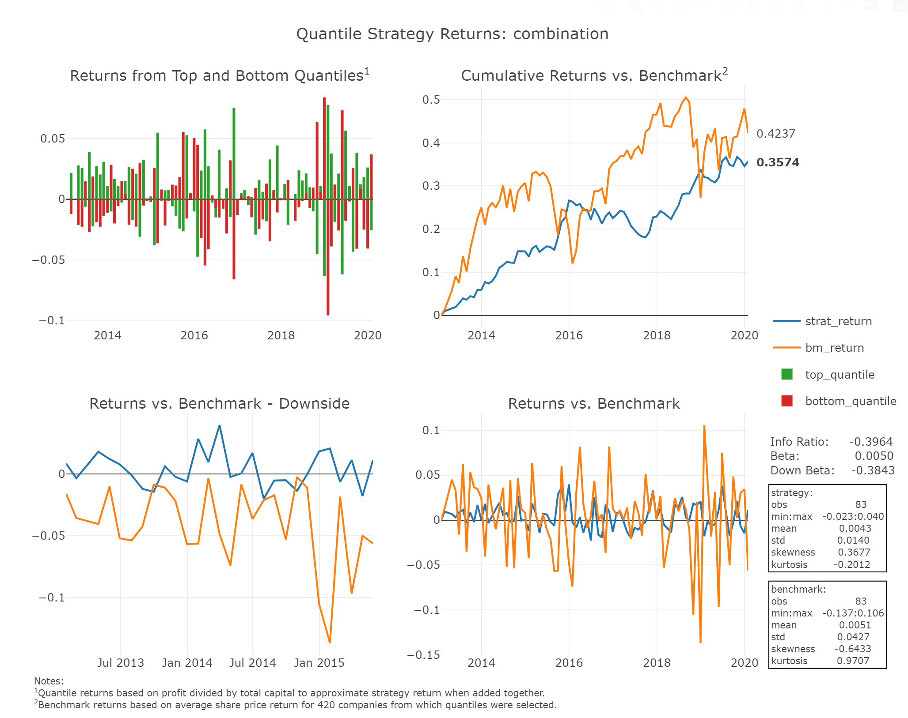

# FINM33150 - Quantile Trading

<!-- START doctoc generated TOC please keep comment here to allow auto update -->
<!-- END doctoc generated TOC please keep comment here to allow auto update -->

## Dependencies

Create a virtual environment and install dependencies with

    pipenv install

## Assignment
For this assignment we evaluate various quantile trading strategies based on ranked financial ratios calculated from [Zacks Fundamentals Collection B](https://www.quandl.com/databases/ZFB/documentation) over the period from 2013-01-31 to 2020-01-31.

**Companies Universe**

The universe of \[~400\] companies from which top and bottom quantiles are selected for inclusion in the various strategies meet the following criteria:

* Not in the Finance (Finance includes insurance) or Auto/Tires/Trucks as indicated by `MT/zacks_x_sector_desc`
* End of day closing prices available over the entire period
* Market capitalization of at least $250M as of 2011-12-31 as indicated by `MKTV/mkt_val`
* `FR/lterm_debt_cap` greater than 0.1 sometime during the period

**Ratios**

Strategies based on monthly rankings of the ratios below, as well as changes in these ratios, are evaluated. Income statement items used in the calculation of the ratios are on a trailing four quarters basis.

* Debt to Market Value
* Return on Investment - EBT
* Return on Investment - EBIT
* Price-to-Earnings
* Combination of Price-to-Earnings and Return on Investment - EBIT

**Naming Conventions**

* `top` quantile refers to the quantile for which long positions are established and includes companies with lower ranks
* `bottom `refers` to the quantile for which short positions are established

**Evaluation**

Strategies are evaluated based on total return, standard deviation, information ratio and downside beta. The benchmark return used for comparison is the average stock price performance of the companies in the universe from which top and bottom quantiles are selected.

The best strategy evaluated was a combination of changes in return on investment on an operating income basis and price-earnings ratios.

